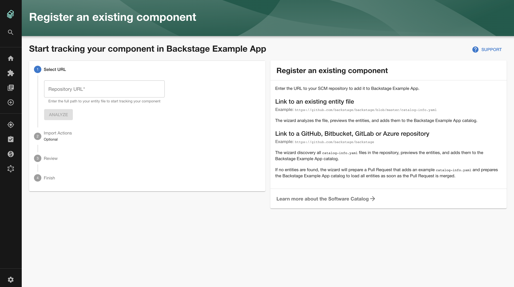

# Catalog Import

The Catalog Import Plugin provides a wizard to onboard projects with existing `catalog-info.yaml` files.
It also assists by creating pull requests in repositories where no `catalog-info.yaml` exists.



Current features:

- Import `catalog-info.yaml` files from a URL in a repository of one of the supported Git integrations (example `https://github.com/backstage/backstage/catalog-info.yaml`).
- _[GitHub only]_ Search for all `catalog-info.yaml` files in a Git repository (example: `https://github.com/backstage/backstage`).
- _[GitHub only]_ Analyze a repository, generate a Component entity, and create a Pull Request to onboard the repository.

Some features are not yet available for all supported Git providers.

## Getting Started

1. Install the Catalog Import Plugin:

```bash
# From your Backstage root directory
cd packages/app
yarn add @backstage/plugin-catalog-import
```

2. Add the `CatalogImportPage` extension to the app:

```tsx
// packages/app/src/App.tsx

import { CatalogImportPage } from '@backstage/plugin-catalog-import';

<Route path="/catalog-import" element={<CatalogImportPage />} />;
```

## Customizations

### Custom layout

A custom layout can be passed to the import page, as it's already
supported by the search page. If no custom layout is passed, the default layout
is used.

```typescript
<Route path="/catalog-import" element={<CatalogImportPage />}>
  <Page themeId="home">
    <Header title="Register an existing component" />
    <Content>
      <ContentHeader title="Start tracking your components">
        <SupportButton>
          Start tracking your component in Backstage by adding it to the
          software catalog.
        </SupportButton>
      </ContentHeader>

      <Grid container spacing={2} direction="row-reverse">
        <Grid item xs={12} md={4} lg={6} xl={8}>
          Hello World
        </Grid>

        <Grid item xs={12} md={8} lg={6} xl={4}>
          <ImportStepper />
        </Grid>
      </Grid>
    </Content>
  </Page>
</Route>
```

Previously it was possible to disable and customize the automatic pull request
feature by passing options to `<CatalogImportPage>` (`pullRequest.disable` and
`pullRequest.preparePullRequest`). This functionality is moved to the
`CatalogImportApi` which now provides an optional `preparePullRequest()`
function. The function can either be overridden to generate a different content
for the pull request, or removed to disable this feature.

### Entity filename and branch name

Entity filename (default: `catalog-info.yaml`) and branch name (default: `backstage-integration`) used in pull requests can be configured in `app-config.yaml` as follows:

```yaml
// app-config.yaml

catalog:
  import:
    entityFilename: anvil.yaml
    pullRequestBranchName: anvil-integration
```

### Entity examples

Following React components accept optional props for providing custom example entity and repository paths:

```tsx
<StepInitAnalyzeUrl
  ...
  exampleLocationUrl="https://github.com/acme-corp/our-awesome-api/blob/main/anvil.yaml"
/>
```

```tsx
<ImportInfoCard
  exampleLocationUrl="https://github.com/acme-corp/our-awesome-api/blob/main/anvil.yaml"
  exampleRepositoryUrl="https://github.com/acme-corp/our-awesome-api"
/>
```

## Development

Use `yarn start` to run a [development version](./dev/index.tsx) of the plugin that can be used to validate each flow with mocked data.
